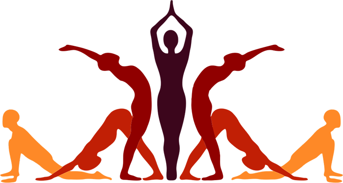

# 🧘 Diwata Yoga Website

A beautiful, responsive yoga website built with modern web technologies to provide an immersive yoga experience for practitioners of all levels.



## 🌟 Features

### 🎨 Modern Design
- **Elegant Color Scheme**: Professional green and gold palette representing nature and spirituality.
- **Responsive Layout**: Fully responsive design that works on all devices.
- **Smooth Animations**: CSS animations and transitions for an enhanced user experience.
- **Professional Typography**: Playfair Display for headings and Poppins for body text.

### 📱 Pages & Functionality
- **Home**: Engaging hero section with featured content and instructor showcase.
- **Information**: Comprehensive yoga resources including articles, poses, and video tutorials.
- **Search**: Dynamic pose search functionality with XML data integration.
- **Gallery**: Beautiful image gallery with filtering capabilities.
- **About Us**: Team information with interactive maps and contact details.

### ⚡ Interactive Features
- **Mobile Navigation**: Hamburger menu for mobile devices.
- **Content Filtering**: Filter poses, videos, and gallery items by difficulty and categories.
- **Smooth Scrolling**: Enhanced navigation within pages.
- **Contact Forms**: Email integration using EmailJS.
- **Scroll Animations**: Elements animate as you scroll down the page.
- **Client-Side Search**: Pure JavaScript search without server requirements.

## 🛠️ Technology Stack

### Frontend
- **HTML5**: Semantic markup with modern structure.
- **CSS3**: Advanced features including CSS Grid, Flexbox, and CSS Variables.
- **JavaScript (ES6+)**: Vanilla JavaScript for all interactions.
- **CSS Animations**: Keyframe animations and transitions.

### Data & External Services
- **XML**: Data storage for yoga poses (`assets/data/poses.xml`).
- **EmailJS**: Contact form email service integration.
- **Google Fonts**: Typography (Poppins & Playfair Display).
- **YouTube Embeds**: Video tutorials integration.
- **Google Maps**: Location maps in the About Us page.

## 📁 Project Structure

diwata-yoga/
├── index.html          # Home page
├── information.html    # Information & resources
├── search.html         # Search functionality
├── gallery.html        # Image gallery
├── aboutus.html        # About Us page
│
├── css/                # Stylesheets
│   ├── global.css      # Global styles & variables
│   ├── home.css
│   ├── information.css
│   ├── gallery.css
│   ├── aboutus.css
│   └── search.css
│
├── js/                 # JavaScript files
│   ├── main.js         # Main functionality & animations
│   └── emailfunc.js    # EmailJS integration
│
└── assets/
    ├── data/
    │   └── poses.xml   # Yoga poses database
    └── images/         # All project images
        ├── logo_diwata_yoga.png
        ├── position_*.webp
        ├── instructor_*.jpg
        └── ...


## 🚀 Quick Start

### Prerequisites
- A modern web browser.
- A local web server (optional, but recommended for full functionality).

### Running Locally

1.  **Download or Clone the Project**
    ```bash
    # If you use Git
    git clone [https://your-repository-url.git](https://your-repository-url.git)
    # Or download the ZIP and extract it
    ```

2.  **Choose a Method to Run:**

    #### Method 1: Simple (Browser)
    Open the `index.html` file directly in your web browser.
    > **Note:** Some features (like fetching the `poses.xml` file) may be blocked by browser security (CORS policy) when run this way.

    #### Method 2: Local Server (Recommended)
    Use a simple local server to avoid browser security issues.

    * **Using Python 3:**
        ```bash
        cd /path/to/diwata-yoga
        python -m http.server 8000
        ```
    * **Using Node.js (with `http-server`):**
        ```bash
        # Install http-server if you don't have it
        npm install -g http-server
        # Run from the project's root directory
        http-server
        ```
    * **Using PHP:**
        ```bash
        cd /path/to/diwata-yoga
        php -S localhost:8000
        ```
3.  **Access the Website**
    Navigate to `http://localhost:8000` (or the port your server is using) in your browser.

### Configure EmailJS (Optional)
To make the contact form work:
1.  Sign up for a free account at [EmailJS](https://www.emailjs.com).
2.  Find your **Service ID**, **Template ID**, and **Public Key**.
3.  Update these values in the `js/emailfunc.js` file.

---

## 🔑 Key Features Explained

### Search Functionality
- **Pure JavaScript**: No server-side processing required.
- **XML Data Source**: Poses stored in `poses.xml` are loaded via the JavaScript Fetch API.
- **Real-time Search**: Get instant results as you type.
- **Filter by Difficulty**: Includes categories for Easy, Intermediate, and Hard.
- **Popular Suggestions**: Quick search tags for common poses.

### Responsive Design
- **Mobile-First Approach**: Optimized for mobile devices.
- **Flexible Grids**: Uses modern CSS Grid and Flexbox layouts.
- **Adaptive Navigation**: Features a collapsible mobile menu.
- **Touch-Friendly**: Designed with appropriate button sizes and spacing.

### Animation System
- **Scroll Animations**: Elements fade in as you scroll using the Intersection Observer API.
- **Hover Effects**: Interactive card animations on hover.
- **Smooth Transitions**: CSS transitions are used for all interactions.
- **Performance Optimized**: Uses efficient animation triggers.

---

## 🎨 Design System

### Color Palette
- **Primary Green**: `#2D5F5D` (Calming, natural)
- **Accent Gold**: `#C9A978` (Warm, spiritual)
- **Background**: `#F8F9FA` (Clean, light)
- **Surface**: `#FFFFFF` (Cards, sections)

### Typography Scale
- **Headings**: Playfair Display (600 weight)
- **Body**: Poppins (300-500 weights)
- **Hierarchy**: Clear visual hierarchy with appropriate sizing.

### Spacing System
- **XS**: `0.5rem`
- **SM**: `1rem`
- **MD**: `2rem`
- **LG**: `3rem`
- **XL**: `5rem`

---

## 🔧 Customization

### Adding New Yoga Poses
1.  Edit `assets/data/poses.xml`.
2.  Add a new `<pose>` element with the following tags:
    - `<name>`: Pose name
    - `<description>`: Detailed description
    - `<benefits>`: Key benefits
    - `<difficulty>`: Easy / Intermediate / Hard
    - `<image>`: Image filename (e.g., `pose_new.jpg`)

### Modifying Styles
- **Global Variables**: Edit CSS custom properties in `css/global.css`.
- **Component Styles**: Modify individual page CSS files (e.g., `css/home.css`).
- **Color Scheme**: Update color variables in `css/global.css` for quick theme changes.

### Adding Pages
1.  Create a new HTML file (e.g., `newpage.html`).
2.  Add a corresponding CSS file in the `css/` folder (e.g., `newpage.css`).
3.  Update the navigation bar in all HTML files to include a link to the new page.

---

## 🌐 Deployment

### Static Hosting Options
- **GitHub Pages**: Free hosting for static sites.
- **Netlify**: Easy drag-and-drop deployment.
- **Vercel**: Fast deployment with Git integration.
- **Traditional Web Hosting**: Any static file hosting service.

### Deployment Steps
1.  Upload all project files and folders to your hosting provider.
2.  Ensure the file structure is maintained.
3.  Test all functionality, especially links and the search, on the live site.

## 📱 Browser Support
- **Chrome** 60+
- **Firefox** 55+
- **Safari** 12+
- **Edge** 79+

## 🚀 Performance Features
- **Lazy Loading**: Images load as they enter the viewport.
- **Optimized Assets**: Compressed images and efficient CSS.
- **Pure JavaScript**: No framework overhead.
- **CSS Variables**: Efficient theming and updates.
- **Client-Side Processing**: No server dependencies for core features.

## 📞 Contact & Support

### Developers
- **Marc Parubrub** (Lead Developer)
- **Veeny Bautista** (Assistant Developer)

### Contact Information
- **Location**: Upper Tuyo, Balanga City, Bataan
- **Phone**: 09691731931 / 09386109857

## 📄 License
© 2024 Diwata Yoga. All rights reserved.

## 🙏 Acknowledgments
- Yoga instructors and content contributors
- Ekhart Yoga for article references
- YouTube creators for video content
- Google Fonts for typography
- EmailJS for contact form functionality

---
Experience tranquility and peace through mindful yoga practice with Diwata Yoga. A fully client-side application that brings yoga to everyone, everywhere.